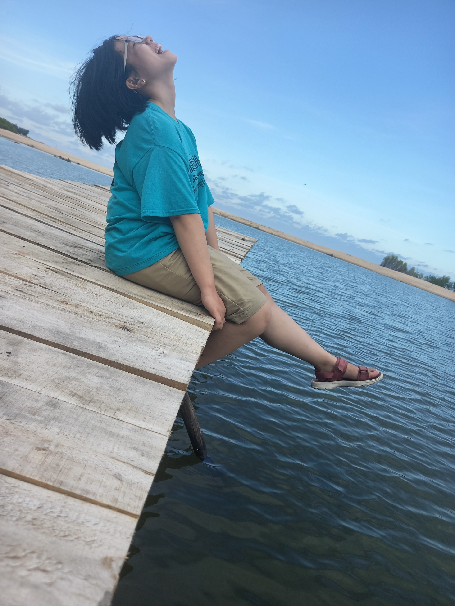

Từ năm 19 tuổi, mình bắt đầu cuộc hành trình đi tìm thử thách. Đau khổ và lớn lên cùng những thử thách, song song với đó, mình đi tìm chính mình. Mình nhận ra, bản thân không hề bất biến. Mình đã hết vô tư hồn nhiên theo cái định nghĩa mình từng sử dụng hồi học phổ thông, mình ít ham chơi hơn, dành thời gian suy nghĩ nhiều hơn và trở nên ít thân thiết với những người bạn từng thân thiết. Mình hiểu tại sao những điều đó xảy đến với mình và chấp nhận chúng như cách mình chấp nhận sự quằn quại khi đối diện với thử thách. Mình cố gắng tách bản thân làm đôi, dùng bản thể thứ 2 đó quan sát chính mình, để mình luôn biết được "Mình là ai".
