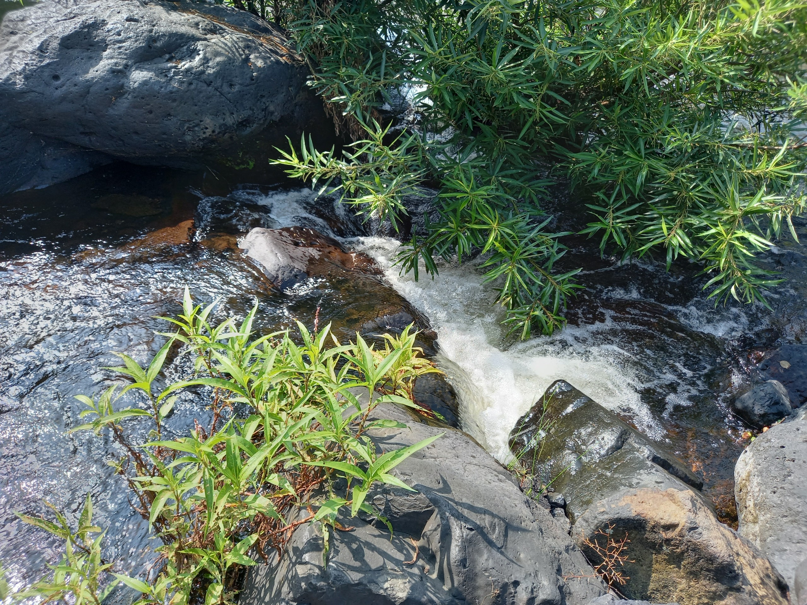

  Như dòng chảy của nước

 

Mình thích nói và mình làm tốt việc này. Nhu cầu chia sẻ, lắng nghe và bàn luận của mình đều được đáp ứng thông quá những cuộc trò chuyện thường ngày với người bạn thân của mình. Mình làm dụng việc nói và không cho khả năng viết của mình một cơ hội. Mình không thích viết và mình không hề làm tốt việc này. Tuy nhiên, mình hiểu rằng cần phải biết viết. Đó là lý do mình tạo ra blog này: Ép mình viết. Mình không tập trung vào hướng kể chuyện nói về quá trình mình đạt được một thành tựu nào đó, những người mình gặp hay những nơi mình đến, mình chia sẻ suy nghĩ và lập luận để chứng minh cho những suy nghĩ đó. Mình viết chưa hay và mọi người đón nhận chưa nhiều. Mình vẫn viết và luôn mong chờ ai đó phản bác hay đồng ý thông qua bình luận, nhắn tin nhưng chỉ có một vài người. Đó cũng là một niềm vui lớn. Mình không quên rằng, mình viết là vì bản thân mình!