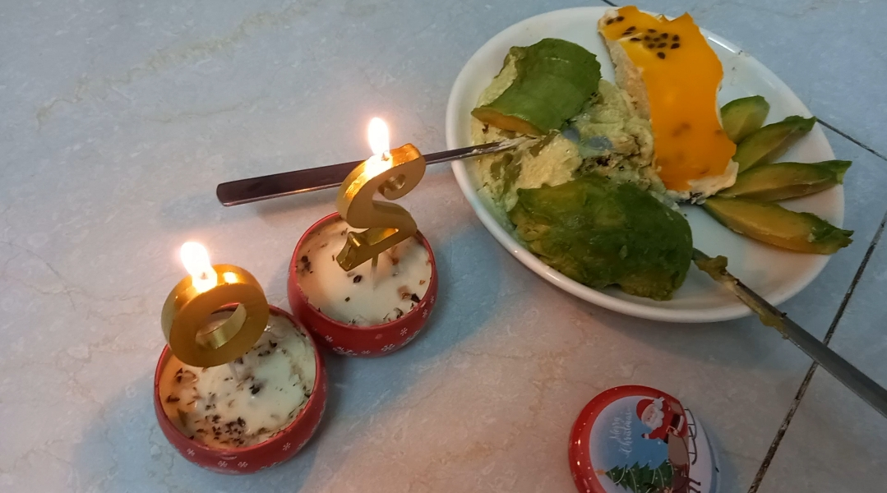

Bữa giờ bỏ bê Chạy Lung Tung quá, mình quay lại viết vài dòng…

Cứ hễ bận cái gì đó liên tục thì mình lại ngừng viết, giờ đây đăng bài tức là mình cũng đã xong việc. Với mình, viết là câu chuyện của cảm hứng, nếu không có blog chắc mình cũng chẳng viết ra làm gì, suy ngẫm thôi cũng thấy thoải mái rồi. Trong 1 tháng bận rộn, mình ham cạnh tranh, ham suy nghĩ, ham cãi lộn và ham cả mộng mơ, mình còn tâm trí nào cho viết lách nữa chứ. Thôi bỏ qua câu chuyện lâu rồi không viết, mình nhìn lại một tháng vừa qua.

*Photo: I went on a trip on my 20th birthday*

Đó là khoảng thời gian mình không ngừng tiến về phía trước, chính là hành động cúi thấp đầu, dang tay và chạy. Không phải mình không quang minh chính đại bước đi, mà mình cứ lao đi không một lần ngoảnh lại: “Dừng lại để bình tĩnh - Không, tao muốn thắng. Dừng lại để biết tại sao mình bắt đầu - Không, tao không cần biết, hay Dừng lại để nghỉ ngơi nhiều chút - Không, tao sẽ thua mất”. Mình chạy theo điều mình ao ước, chạy theo điều có thể khiến mình hạnh phúc, mình tin thật nhiều và kỳ vọng cũng thật nhiều. Cuối cùng, kết quả không như mình mong muốn, mình buồn. Nhìn vào hư không và dần đắm chìm vào nỗi buồn không một từ ngữ nào diễn tả được, mình tự kéo bản thân về thực tại để trông mình bớt đáng thương một chút. Mình đã không đặt câu hỏi rằng một tháng qua mình cố gắng vì điều gì hay tìm cớ trách móc bản thân, đồng đội và giám khảo như lần thi trước, vì chính mình cũng rõ một tháng qua đáng nhớ và tuyệt vời như thế nào. Nếu nói chừng đó thôi cũng đủ với mình rồi thì thật ra mình chỉ đang biện minh cho kẻ thua cuộc Trương Hoàng Huyền Minh. Vì mình tham vọng. Mình muốn nhiều hơn thế, mình biết mình có thể làm tốt hơn, nhưng mình đã không thắng được. Tuy nhiên, mình không phải là kẻ thua cuộc, ít nhất mình tin là vậy. Mà thực ra mình cũng đâu còn sự lựa chọn nào khác, chẳng ai muốn lún sâu vào đầm lầy tội lỗi, ngày ngày quanh quẩn với cái suy nghĩ trách móc bản thân, khó thoát ra lắm ai ơi. Chuyện là mình mới đi thi về mà mọi người biết đó, thi mà không được thì về viết bài than thân trách phận thôi chứ sao giờ (thở dài). 

*Photo: My modest birthday with candles and no-added sugar homemade cheesecakes*

Bài này không viết để ghi lại những gì đã học được trong 1 tháng qua, mình không quen viết kiểu đó lắm. Chỉ là một chút suy ngẫm về hạnh phúc. Mọi người thấy đó, chúng ta chạy theo mục tiêu, chạy theo kỳ vọng và tin rằng khi đạt được mục tiêu rồi, chúng ta sẽ hạnh phúc. Dù biết nếu không được như mong muốn, mình sẽ buồn kinh khủng nhưng “People face trade-off” (Con người luôn phải đánh đổi) mà. Nhiều khi mình ước rằng bản thân không bắt đầu và theo đuổi, khi đó, mình sẽ không phải trải qua cái cảm xúc tồi tệ khi không được như ý muốn nữa. Nhưng nếu không có mục tiêu để theo đuổi, mình lại rơi vào những ngày nằm dài chán nản không biết phải làm gì, nó sẽ buồn và buồn theo kiểu khác ở trên. Con người kì lạ ha, thôi không đánh đồng, mình nhiều chuyện ha! Với rất rất nhiều người, mục tiêu của cuộc đời chính là hạnh phúc: kiếm nhiều tiền để có một cuộc sống sung túc, ăn no mặc ấm, rốt cuộc cũng chỉ để có được hạnh phúc; chạy theo ước mơ hoài bão để thỏa mãn cơn khát, không rõ cơn khát gì vì mỗi người mỗi kiểu, mình xin phép đoán đó là hạnh phúc, chạy trốn nỗi buồn và tìm kiếm niềm vui chẳng phải cũng là một điều con người hay làm để kiếm tìm hạnh phúc hay sao? Con người luôn cố gắng chạy đến hạnh phúc, liên tục và liên tục, và rồi tạo ra điều điều khiến con người đau khổ. Nếu không đạt được mục tiêu, chúng ta sẽ buồn, như mình ở trên á, đau khổ trên con đường đi đến hạnh phúc. Suy cho cùng thì đau khổ và hạnh phúc là 2 cảm xúc/trạng thái không thể nào tách rời, vì có hạnh phúc, tức phải có đau khổ (hay bất kỳ từ nào trái nghĩa với hạnh phúc) giống như có cao thì có thấp, có đẹp thì có xấu vậy đó. Học cách chấp nhận đau khổ và sẵn sàng đối diện với nó chính là cách mình đi đến hạnh phúc. Vì mình biết đau khổ sẽ luôn đến, dù là một ngày nắng đẹp hay mưa giông, đau khổ vẫn sẽ đến. Mình không mong chờ nhưng khi nó đến, mình sẽ tiếp đãi và đắm chìm vào không gian có mình và nó, để rồi tiễn nó đi và mình lại tiếp tục bước đến hạnh phúc của mình. Đau khổ khiến con đường đi đến hạnh phúc của mình trở nên ý nghĩa, khi hạnh phúc mang ý nghĩa xoa dịu những khổ đau thay vì chỉ là một đích đến có tên. Đọc Sapiens xong, quan điểm về hạnh phúc của mình thay đổi nhiều lắm. Mình không thấy tiếc thương như trước khi những người lao động khổ cực có một cuộc sống thiếu thốn trăm bề nữa vì mình biết chỉ có họ mới biết, họ có thực sự khổ cực như chúng ta thấy hay không. Và mình chắc chắn rằng giữa trăm đường khổ cực đó, họ vẫn có hạnh phúc của riêng mình. Đôi khi chúng ta cảm thấy bất lực khi không giúp đỡ được mọi người nghèo trên thế giới này cũng không sao nhé, họ vẫn sẽ có hạnh phúc của riêng mình, đó chẳng phải là đích đến của cuộc đời sao? Tất nhiên, mình không nói điều này ra để chúng ta không giúp đỡ những người cần giúp đỡ nữa, việc giúp đỡ khiến mọi người trở nên hạnh phúc hơn mà. Tiếp tục làm người tốt với lòng trắc ẩn của bạn nhé. Những điều mình nói ở trên, rút ra được sau khi mình đọc Sapiens, có thể diễn tả không kĩ lắm, mọi người đọc để hiểu rõ hơn nha!

Với khả năng ngôn ngữ của mình, mình chỉ diễn tả được tới đây thôi. Không kể chuyện cụ thể mà mong mọi người hiểu thì đúng là tham lam vô lý mà. Dù sao thì cũng viết để an ủi bản thân một chút để mạnh mẽ hơn trên con đường sắp tới. Cảm ơn những người mình yêu thương, tất nhiên là vì tất cả rồi!!!!

Xin lỗi bạn đọc vì bài viết không có tiêu đề, vì cái kết luận chệch hướng và cách hành văn chưa hay của mình. Nhưng blog này là của tao (của mình, hehe).