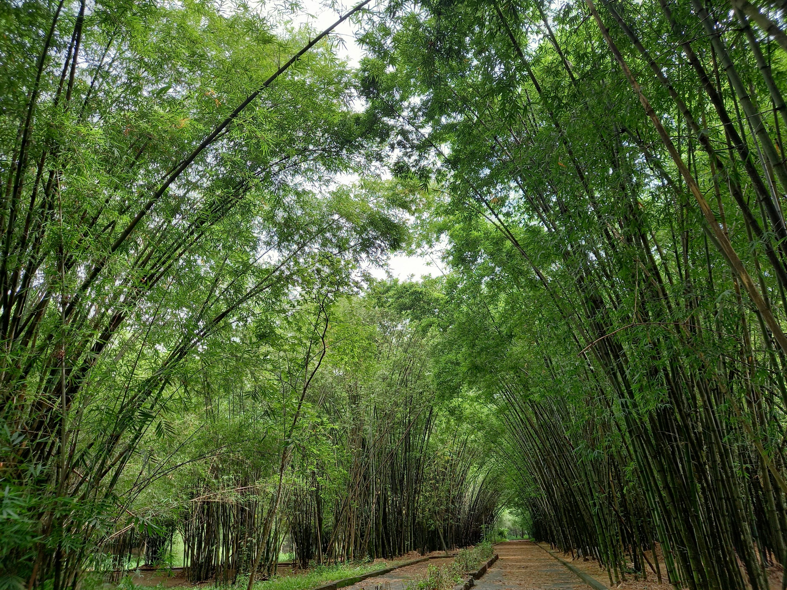

Mình thích những điều dễ thương, à mà ai chẳng thích…

Bumblebeans, Shizuka, Chạy lung tung hay Chim cánh cụt nhỏ (cái này chưa thi nữa mà cứ để tạm vào đi) là những cái tên nhóm đồng hành cùng mình trong những cuộc thi. Và lần này, trước thềm chung kết của E-CON 2022, mình sẽ kể về The Honeybunch (Lấy cảm hứng từ bài hát “You're my Honeybunch, Sugarplum”, mình để link Youtube ở đây nè https://www.youtube.com/watch?v=7Ta5Vz4O-tk).

Trong một lần làm task có liên quan đến CLB ở các trường đại học, mình vô tình tìm thấy BEC FTU2 và mình nhấn Like. Chính vì thế, sau này á, mình thấy bài đăng khởi động E-CON 2022, cuộc thi về tiếng Anh thương mại do BEC FTU2 tổ chức. Mình chưa từng nghĩ mình sẽ tham gia cuộc thi nào của FTU trong tương lai gần cả vì hiện tại mình muốn tập trung vào học nhiều hơn. Tuy nhiên, cơ hội tới mà không nắm bắt thì quả là đáng tiếc cho Chạy lung tung rồi, mình quyết định thi luôn. 
Người đầu tiên mình nghĩ tới là JoeyLee bạn thân của mình. Nhưng mình và JoeyLee cãi nhau quá nhiều lúc làm việc, dễ gây ảnh hưởng tới teammate khác. Hơn thế nữa, JoeyLee học AI. Thế là mình rủ Huy (Huy học AI), mình đã thi chung với Huy một cuộc thi trước đó nên không khó trong lần lập team này. Team cần 3 người nên mình và Huy phải kiếm thêm 1 bạn nữa. Hai đứa thoải mái đến nỗi sắp đến hạn đăng ký rồi, ngày mai mà không kiếm được người thứ ba thì mình khỏi thi. May quá, người thứ 3 đã xuất hiện, hahaha đó là Châu, bạn gái của Huy. Có lẽ mình nhận làm người thứ 3 chắc hợp lý hơn nhưng mình cũng có phải là người thứ 3 đâu. Thôi thì cũng mừng, có team rồi. 

*Ảnh: Sau này đi thi nhiều hơn, mình nếm trải thất bại cũng nhiều hơn. Mình phải học cách kiên cường như cây tre vậy*

Ở vòng 1, tụi mình thi trắc nghiệm kiến thức tiếng Anh (80%) và làm video tính điểm tương tác (20%). Được lọt vào top 16 (Vòng 2) là điều mình chưa từng, chưa từng ngờ tới. Nhưng mà cũng lọt rồi. 

Ở vòng 2, tụi mình thi Đàm phán (Negotiate), nghe thích ghê nhưng mà sợ khó. Thì đúng là khó thiệt vì kiểu này mới với tụi mình lắm, hơn nữa chỉ có 15 phút để vừa đọc đề vừa bàn luận. Ở vòng này, tụi mình vẫn thoải mái vì chọn 4 đội trong 16 đội, rớt cũng không sao. Cái miệng nói vậy thôi chứ muốn vào vòng trong dữ lắm, thế là cố gắng và rồi cũng vào top 4. Sướnggggg!
Ở vòng 3, tụi mình chưa thi.

Là người chưa từng tham gia cuộc thi nào của FTU, mình khá thoải mái cho lần đầu này. Mình thi để biết bản thân mình đang ở đâu, thua kém người ta ở điểm nào (Câu này nghe hơi bịa nhưng mà thiệt, mình có cái quyền của một fresher mà). Học tập tại một ngôi trường không phải trường top khiến mình cảm thấy tự ti so với các bạn học trường top (èo🙄). Mình cũng có phân tích nhiều khía cạnh, mọi chuyện đều dẫn tới kết luận là mình khùng quá nhưng mà cứ bị tự ti vậy đó. Tuy nhiên, việc đó không thể ngăn mình tự tin thể hiện bản thân (Well, nó không mâu thuẫn đâu). Chúng ta thường khó ngăn những điều tiêu cực xuất hiện trong đầu và chúng ta cũng khó ngăn chúng ta trở thành chính mình. Quan trọng là: Cái nào thắng?

Bài viết này mang tính chất của văn nói vì mình đang kể chuyện đó. Khi đi thi, mình ít kể như này lắm, tranh thủ rủ mọi người đi coi chung kết nên mình viết 1 bài cho vui.