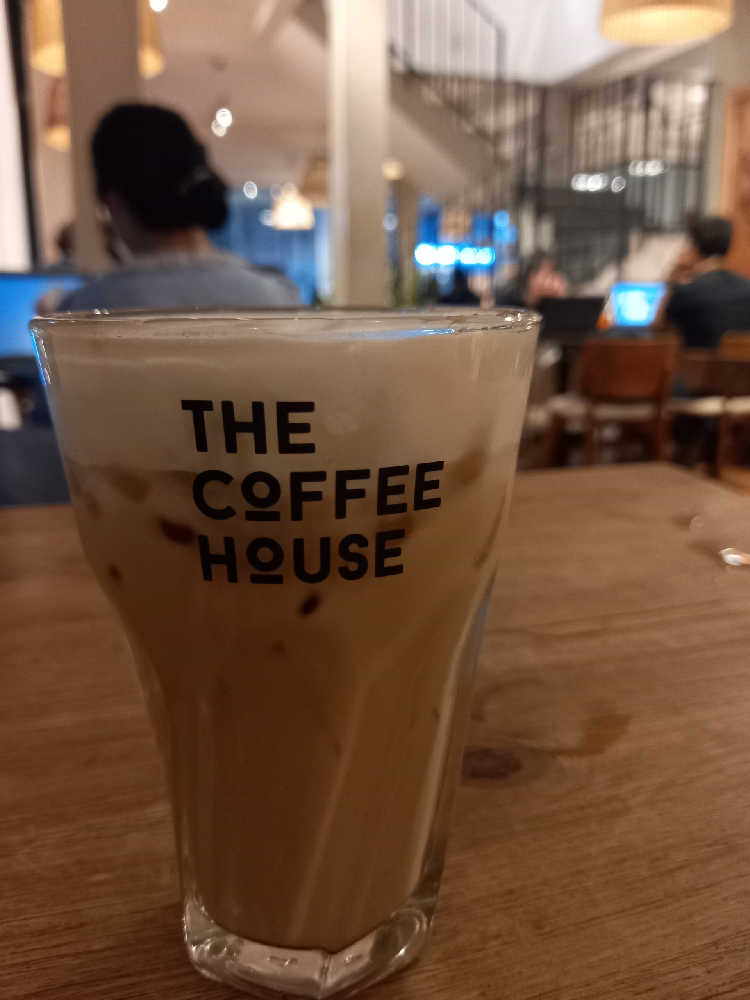
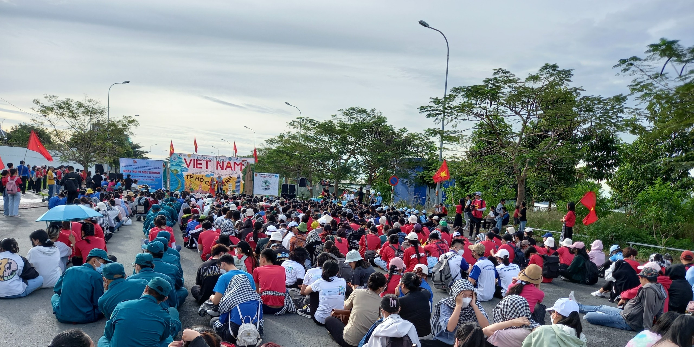

Vài tháng rồi không viết bài, bây giờ mình mới có thể ngồi ngay ngắn để viết. Thật ra mình vẫn có thời gian để viết, vẫn có chủ đề để nói linh tinh nhưng tâm trí mình thì không chịu vì mình chẳng thể tập trung được. Gần đây đầu mình bị quá tải bởi việc lên ý tưởng, mình buộc phải đọc một lượng lớn thông tin từ nhiều nguồn, nhiều mảng khác nhau để nghĩ ra cái gì đó khiến mình thỏa mãn. Phần lớn thời gian chạy loanh quanh vài thứ mình không muốn bỏ lỡ, tới lúc sự mệt mỏi đã thấm, mình biết mình cần nghỉ ngơi. Vậy đó, mình ít ưu tiên blog hơn nên mấy tháng qua đành cất em nó vào 1 góc, chờ ngày này đến, viết gì đó thôi.

Gần đây mình có viết bài về một vấn đề xã hội mà mình quan tâm (không đăng lên), chắc một vài người bạn mình cũng đoán được, mình viết về môi trường. Khi chọn vấn đề đó đó để nói, mình cũng hơi quan ngại rằng nó cũ và nghe hoài riết thuộc. Nhưng biết sao giờ, đó là cái mình quan tâm và muốn thay đổi nhất. Thế nên, mình viết khác một chút: thay vì đề cập đến những hiện tượng thời tiết cực đoan đang xảy ra hay những gì mình lo sợ về tương lai con cháu, mình viết về niềm tin. 
Mình đặt câu hỏi: Có khi nào mọi người không tin rằng một hành động nhỏ, một con người nhỏ bé có thể thay đổi thế giới nên mới không sống xanh không? Rõ ràng là tiết kiệm một vài cái túi nilon, một vài cái chai nhựa hay nhịn mua một chút quần áo không thể khiến các nhà máy sản xuất ít lại hay núi rác ngoài kia vơi đi một phần đáng kể. Dù có lấy hết rác thải của một đời người đem đi chỗ khác thì thế giới rác vẫn hoàn thế giới rác mà thôi. Vậy thì hà cớ gì phải bớt đi vài miếng rác để khiến cuộc sống mình bất tiện hơn chỉ vì một mục đích vô nghĩa? Mình nghĩ niềm tin này đúng và đúng trong trường hợp một người tách bản thân ra khỏi xã hội khi bất kỳ hành động nào của người đó cũng không ảnh hưởng đến những người xung quanh. Và chính vì mình có người thân và bạn bè xung quanh nên mình chọn tin một điều khác. Mình tin rằng một hành động nhỏ của mình cũng có thể tạo nên thay đổi lớn cho dù ngay thời điểm mình làm hành động đó, nó không lớn lao là bao.

*Photo: I don't use straws anymore*

Tại sao mình tin như vậy? Vì mình đã thấy. Mình ráng xài ít nhựa nhất có thể, mình làm gì đó để chứng tỏ rằng mình không muốn xài nhựa, trước mặt những người xung quanh. Khi việc đó lặp đi lặp lại đủ nhiều, họ sẽ bị ảnh hưởng bởi mình. Và rồi, thay đổi tí tẹo. Dù cho nó từ từ và nhỏ giọt nhưng vẫn có hiệu quả. Đó chỉ là câu chuyện của vài năm, nếu nhiều năm nữa trôi qua, mình nghĩ tác động sẽ lớn hơn nhiều. Niềm tin và hành động của người này được truyền đến người kia, theo cách trực tiếp hay gián tiếp, nó liên kết và cùng nhau xây đắp nên một cộng đồng cùng chung lý tưởng, hành động vì một tương lai tốt hơn, từ vài điều nhỏ bé. Nghe thật mơ mộng, nhưng cũng không hẳn là phi thực tế. Nếu không tin thì mình hẳn sẽ không làm. Nếu không tin thì lý tưởng ở trên cũng không được vẽ ra. Suy cho cùng, có tin, có làm, có lý tưởng vẫn tốt hơn.

Thật ra, mình lấy dẫn chứng bài mình viết về môi trường để làm tiền đề cho những dòng mình viết về từ thiện sau đây. Mấy ngày trước, mình và bạn mình có tranh cãi về ý nghĩa của hoạt động từ thiện mà mình và các bạn cùng làm: nấu và phát cơm cho người vô gia cư, người lao động nghèo. Bạn mình nghĩ rằng một bữa cơm không có nhiều ý nghĩa lắm với một người và giá trị mà người phát nhận được có khi còn nhiều hơn là người nhận. Nhìn nhận một cách thẳng thắn thì hiện tại có rất nhiều đội nhóm làm từ thiện, họ làm thường xuyên và đều đặn, nên lâu lâu mình phát một bữa thì…có ít ỏi quá không? Ngoài ra, người vô gia cư và người lao động nghèo vẫn lao động để kiếm sống hằng ngày, họ có thật sự cần đến một hộp cơm chay của mình hay không? Mình đã tức giận thay vì cãi bôm bốp như mọi lần. Có lẽ, chính mình cũng đang hoài nghi. 

*Photo: We joined the clean up day. It's gonna full of garbage and debris soon but that day was still worthy*

So sánh câu chuyện làm từ thiện với câu chuyện sống xanh, mình thấy nó cũng tương đồng đấy chứ: chúng đều có tác động thật nhỏ ngay tại lúc tụi mình làm. Nhưng chính nhờ bài viết về môi trường đã nhắc nhở mình về một niềm tin rằng một hành động nhỏ cũng có thể tạo nên thay đổi lớn. Một nhóm chúng mình có gần 20 bạn muốn góp chút sức giúp đỡ nhóm người yếu thế, chúng mình có ít, thật ít ngay lúc này. Và mình, người đang nuôi thật nhiều hy vọng, chỉ có thể tin rằng hành động của chúng mình sẽ lan tỏa đến những người xung quanh, những người có khả năng hơn về trí óc hay tiền bạc. Khi đó, chúng ta sẽ cùng nhau giúp được nhiều hơn, về chất lượng lẫn số lượng. Và khi chúng mình lớn thêm một chút, giỏi thêm một chút, chúng mình sẽ giúp thêm một chút nữa. Có phải đã thật nhiều chút được tạo ra hay sao? Thay vì chờ đến lúc mình đủ khả năng, có nhiều thời gian và tiền bạc rồi mới giúp, hãy giúp khi chúng ta có thật ít những thứ trên nhưng lại có thật nhiều niềm tin và hy vọng về tương lai. Nếu không làm gì cả, những giá trị về mặt lâu dài kể trên có thể không được sinh ra, mình không biết có hệ lụy gì kéo theo nhưng chỉ buồn, thế giới đó với mình sẽ buồn hơn.
Lần này mình sẽ cãi lại bạn mình, vì mình không hoài nghi nữa. Chỉ khi nào mình tự tin, mình mới sẵn sàng đối đầu với mọi thách thức!!! Luôn tiện, sắp tới mình và nhóm bạn sẽ làm một đợt phát cơm cho người vô gia cư và người lao động nghèo. Chúng mình sẽ cố gắng mang đến 2 bữa no trong 1 lần phát, để nhân đôi tác động nhỏ bé. Hy vọng được mọi người ủng hộ nhé!!!