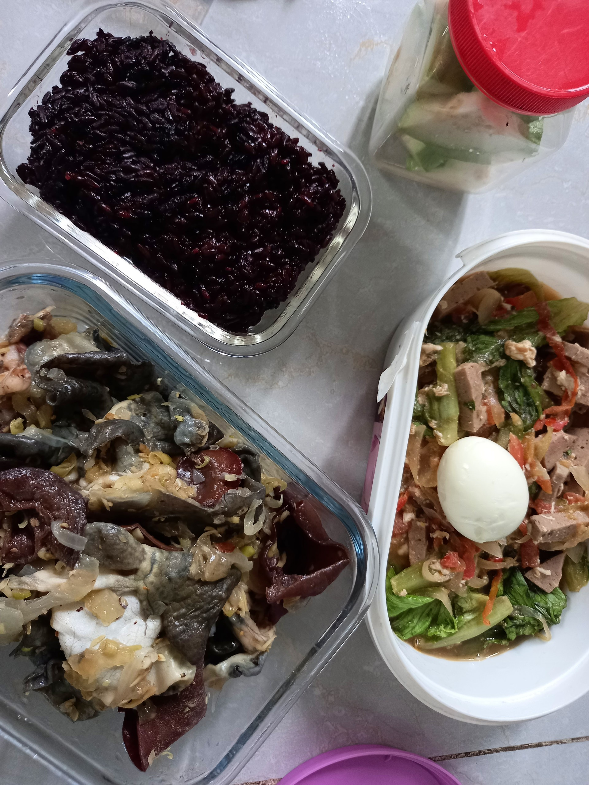

Mình vừa trải qua một hành trình vừa ngắn vừa dài, vừa vui vừa buồn, vừa khỏe vừa mệt. Mình cảm thấy khó khăn trong việc kể lại những gì mình đã trải qua bao gồm bài học, kinh nghiệm quá trình hay thành tích. Mình vẫn đang tự hỏi: Khi mình chưa sẵn sàng chia sẻ nhiều chuyện như vậy, cho dù việc chia sẻ này bằng một cách nào đó mang tới thông điệp “Mình sai để bạn đỡ phải sai” nghe hay ho ha, liệu mình đã sẵn sàng để viết một bài có ích chưa?

Đây là blog cá nhân của mình, mình hoàn toàn có thể viết những gì mình muốn hay mọi suy nghĩ trong đầu nhưng điều đó chỉ dừng lại ở lý thuyết. Đã bao nhiêu lần mình viết ra rồi phải xóa đi vì thấy nó dở ẹc, không ít lần mình xóa chữ vì quan điểm này nói ra kiểu gì cũng bị phản đối dữ dội. Mình còn không biết mình có viết tiếp những dòng này cho tới cuối bài được không, ít nhất ngay tại thời điểm này, đơn giản vì mình sợ chả ai đọc. 

*Photo: Cooking is such a great way to de-stress*

Mình thích đưa những suy nghĩ linh tinh vào blog vì nó thật, không trau chuốt, không hoa mỹ, hơi buồn khi nó thường không mang tính nghệ thuật cao hay có ý nghĩa cho lắm. Vì mình thích vậy nên bài blog cứ đi chệch với hướng suy nghĩ ban đầu của mình, kể cả bây giờ.
Lý do cho việc mình không chia sẻ nhiều trên mạng xã hội, không chắc lắm, mình nghĩ là thói quen. Mình thích tự suy nghĩ hơn. Sau một hành trình, mình thường rơi vào trạng thái mất phương hướng vì chưa rõ tiếp theo phải làm gì, đôi khi tự thưởng cho bản thân một sự nghỉ ngơi quá đáng. Trong trạng thái nghỉ này, mình sẽ nhìn lại những gì đã trải qua, học được gì, nhận được gì, bỏ qua những suy nghĩ tiêu cực và tính tới chuyện làm gì tiếp theo. Với mình, có một người bạn (ngoại trừ bản thân) để kết hết những thứ đó là đủ. Nếu viết lên blog, hình thức là kể với mọi người nhưng thực tế lại chẳng kể được cho ai.

Đôi khi mình làm theo những tiêu chuẩn không biết ai đó đưa ra nên mình vẫn đang hoài nghi lắm về em blog của mình theo những tiêu chuẩn đó. Nếu cảm thấy blog không có ích tức là nó không có ích thật sao? Mình lên đây và giấu nhẹm đi cái mình học được, giấu đi quá trình, kinh nghiệm và cả nỗ lực nữa. Cái blog này có thực sự cần phải tồn tại?

Mình lại muốn làm chuyện lớn rồi: viết một bài blog và hy vọng nó sẽ giúp được nhiều người, hy vọng người ta sẽ đọc hết bài và có trong mình những suy nghĩ gì đó. Có mâu thuẫn giữa những gì mình cho đi và mong muốn được nhận lại không? Mình nghĩ nhiều và nó lộn xộn.
Một kết luận nhỏ: Mình viết blog và mình không chia sẻ nhiều. Việc viết blog có ích cho mình nên Chạy lung tung vẫn cần được chăm sóc và yêu thương. Mình nghĩ một bài viết không có ích không có nghĩa là nó không có ích, mình vẫn đang cố để truyền tải quan điểm cá nhân, thỉnh thoảng là quan niệm sống, biết đâu một ngày mình sẽ sẵn sàng để chia sẻ nhiều thứ hơn, người khác cũng có cái đọc cho vui mắt. 

Một chia sẻ nhỏ: Mình vẫn đang trong thời kỳ nghỉ ngơi nên đã quay lại để viết blog sau một thời gian khá dài. 

Một lời nói nhỏ: Cảm ơn bạn nếu bạn có đọc được hay không đọc được dòng này ha! May quá viết được hết bài.