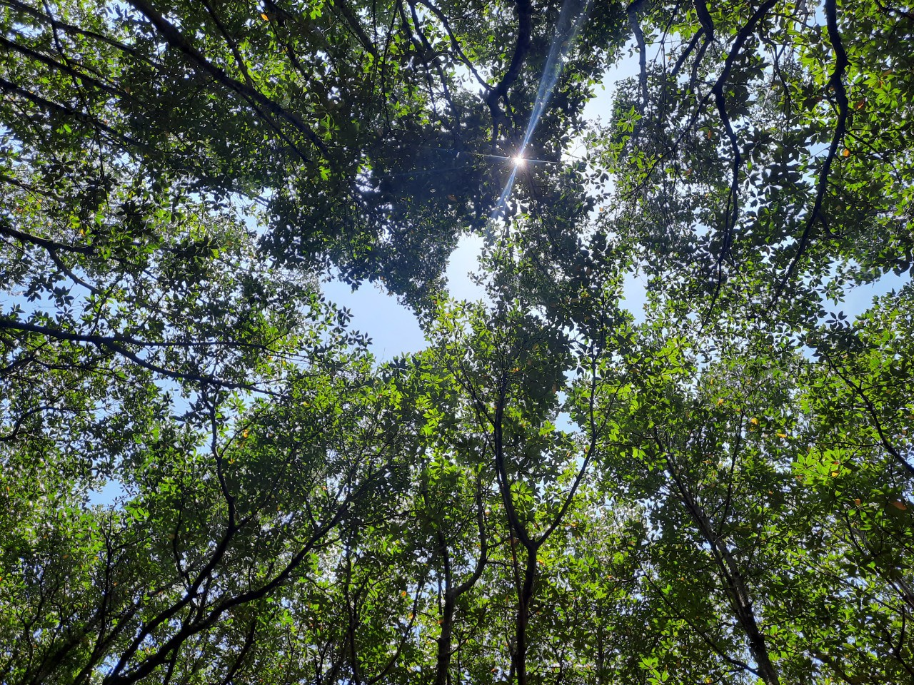

“Mùa hè, tới trường: Đó là 2 từ không bao giờ nên đứng chung với nhau hết”. Mình nghe được Ben nói câu này khi đang xem Ben 10 trong tập phim mọi người đến thăm ngôi trường Bancroft và gặp Bóng Ma. Không hiểu sao, sau khi kể đủ 10 dạng biến hình của Ben, mình nghĩ về câu nói này. Trong lúc ngồi rửa chén, mình bâng quơ nhớ lại những tháng ngày đã cũ. Từ khi ba lô đến trường của mình có sách vở bút thước, không có mùa hè nào mình không đi học. Vào mùa hè năm mình mới vào lớp 1, gia đình mình gửi mình cho một cô giáo trong thôn để học đọc, học viết trước khi được dạy chính thức ở trường. Mọi người đơn giản không muốn mình thua kém những đứa bạn được đi học hè khác và tăng khả năng biết chữ của mình lên kha khá lần.

Trong những năm tháng cấp 1, mùa hè nào mình cũng đi học. Ngoại trừ những trò chơi mà lũ con nít ở quê như tụi mình hay chơi, tụi mình không có cơ hội tiếp xúc với những thứ hay ho ngoài sách vở nhiều lắm. Lớp học hè của mình là Toán, tiếng Việt, tiếng Anh và là những điều mà mình sẽ được dạy y chang ở trường. Mình tại thời điểm đó không đủ khả năng hoặc cũng có thể là không được dạy để đặt câu hỏi: Tại sao con phải đi học hè?

*Ảnh: Mùa hè ở Cần Giờ*

Trong những năm tháng cấp 2, mùa hè nào mình cũng đi học. Một cái ba lô 5kg bỏ đủ tất cả sách vở cho việc học: Toán, Lý, Hóa, Anh, Văn mình không bỏ sót môn nào. Lúc này mình không cần đặt câu hỏi là tại sao mình phải đi học hè nữa, vì nó đã trở thành thói quen luôn rồi. Sống trong môi trường nơi mọi người đều có thói quen như mình, liệu nó có còn được gọi là thói quen?
Trong những năm tháng cấp 3, có một mùa hè mình chỉ học một nửa, nửa còn lại, mình nghỉ học để đi chơi. Đó là mùa hè mình chuẩn bị lên lớp “lá’ của trường cấp 3, lớp 12. Mình đã đánh đổi! Đánh đổi với mình lúc đó rất đơn giản: Làm điều lâu thiệt lâu mới có thay vì làm điều quanh năm vẫn hay làm. Vậy là mình xin nghỉ hẳn một tháng để có 2 tuần ở Hà Nội và 1 tuần ở Đắk Lắk, chạy lung tung một mình và rồi gặp thêm nhiều mình khác cùng chạy. Mình vừa học vừa chơi vừa tăng cân. Mình tại thời điểm đó luôn là niềm tự hào của mình mỗi lần nhớ về. Để bạn đọc có thể hình dung rõ hơn, mình sẽ tạm dùng phép so sánh này: Minh là một con cá nhỏ à không mập ú nu, bơi bơi trong bể cá suốt 16 năm. Rồi một ngày, bể cá được mang ra cạnh bờ sông, cá Minh quyết định nhảy ra khỏi bể một thời gian để xuống xem dưới sông có gì rồi sẽ quay trở lại. Dòng sông to và hay ho một cách kỳ lạ, cá Minh bị đắm chìm trong đó và tham vọng muốn bơi ra biển khơi thay vì quay về bể cá như đã định. Biển to và dữ dội quá, cá Minh bị dập tơi bời luôn, nhưng dù thế nào thì cá Minh cũng chẳng thể quay về là cá Minh trong bể cá nhỏ kia nữa rồi! (Chuyện này kể sau đi)
Những mùa hè trước của mình đã trải qua như thế, lặp đi lặp lại và thật may nó đã có một điểm lấp lánh.

Quay trở lại với câu nói của Ben về việc tới trường hay đi học và mùa hè là điều không bao giờ nên có, mình không ở đây để đồng ý hay phản đối quan điểm này vì với mình, khi chúng ta dùng định nghĩa chung để nói, ranh giới giữa học và chơi đã không còn rõ ràng nữa rồi. Việc mình đánh đổi 1 tháng chăm chỉ học thi đại học với 1 tháng tham gia hoạt động ngoại khóa, đơn giản là đánh đổi việc học kiểu này thay vì học kiểu kia mà thôi. Nhưng với góc độ của một người bất kỳ, việc đó có thể là đánh đổi giữa học và chơi. Trong thế giới nơi có quá nhiều quan điểm được nêu lên, chúng ta vô tình đưa định nghĩa chung trở thành định nghĩa cá nhân và đã là chung thì không thể là riêng. Chấp nhận cái riêng, làm theo cái riêng, làm theo điều mà bạn cho là đúng và không ảnh hưởng xấu tới người khác có lẽ mới là điều đúng nhất trên đời. 

Mình biết kết luận này không liên quan tới chủ đề mùa hè của mình cho lắm nhưng dù sao nó cũng đã ra được một cái kết luận rồi. Mong các bạn đừng quên những định nghĩa cá nhân của bản thân mình nhé!
