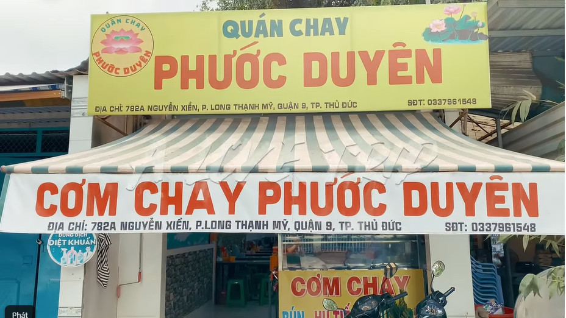
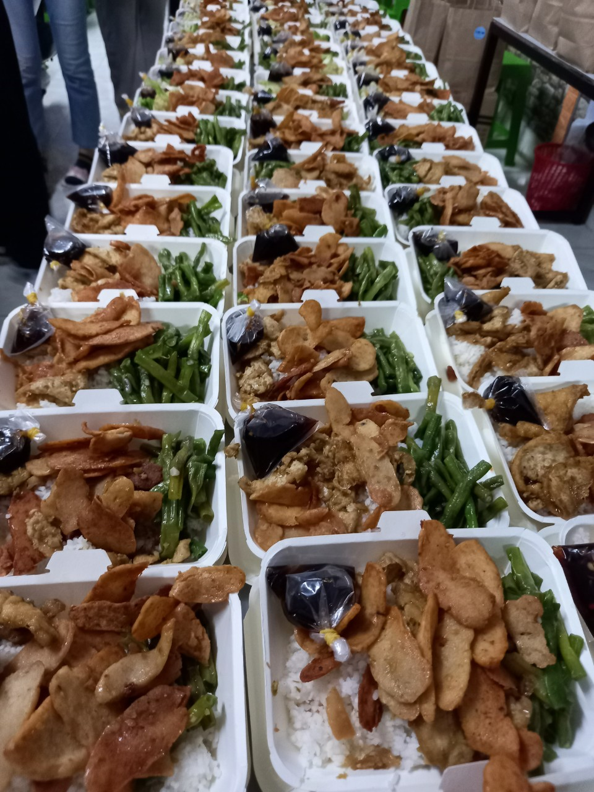
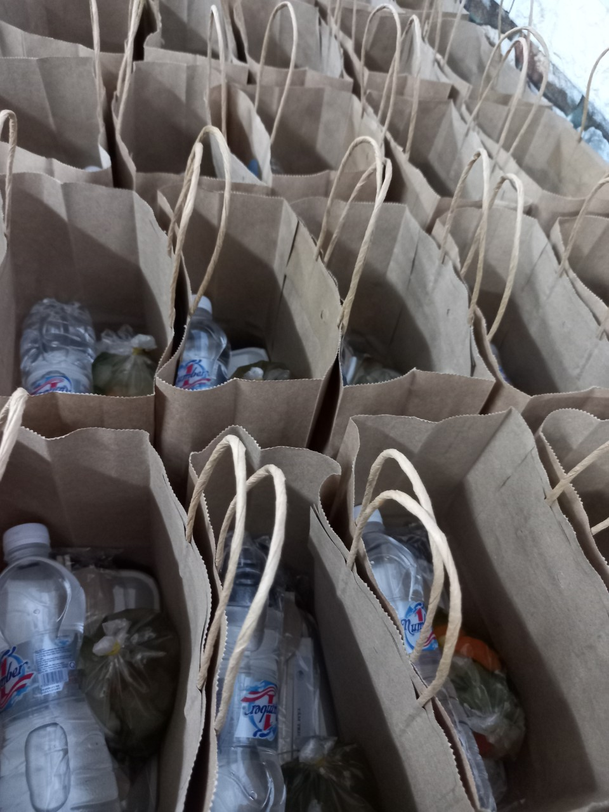

Vì thích quá nên mình quyết định viết một bài về câu chuyện đi tặng cơm với túi và hộp giấy.
Mình vừa tham gia A Love Trip mùa 2, chương trình thiện nguyện tặng cơm cho người vô gia cư và người lao động nghèo. Đây là lần thứ 2 mình tham gia hoạt động từ thiện ở Sài Gòn một cách trực tiếp - trao quà và trao niềm vui tận tay, nếu không kể đến GIVE IT BACK thân yêu của mình. 

Mình được dẫn đến một quán chay nơi chủ quán là một người niềm nở, nhiệt tình và đặc biệt là nấu ăn rất ngon. Chú hiểu rõ công việc và chỉ tụi mình từng bước: từ nguyên liệu cho từng món ăn đến việc ứng xử như thế nào khi người xin không phải là người thực sự cần. Chú cho tụi mình mượn quán để chuẩn bị đồ và nấu ăn. Ban đầu cứ tưởng là chú chỉ đứng sau bắt tay chỉ việc thôi nhưng tụi mình vụng quá nên chú nấu giúp tụi mình luôn. Mình và các bạn quý chú lắm. 

*Ảnh: Quán cơm của chú*

Trong số những bạn đi cùng đợt với mình, có bạn mình chưa bao giờ gặp, có bạn chỉ biết mặt chứ không biết tên cũng có bạn biết mặt biết tên nhưng chưa từng nói chuyện. “Bạn sinh năm mấy?” - “2k2 á” - “Mình cũng 2k2, ừa thôi xưng mày tao luôn đi. Mày học ngành nào?” - Đại loại đây là nơi câu chuyện bắt đầu.

Mình thích tinh thần của những chuyến đi thiện nguyện, thích nhất thích nhất luôn á. Tại một dự án, sự kiện nào đó mình từng tham gia, mỗi người sẽ đến vì một lý do riêng (phát triển bản thân, mở rộng mối quan hệ, làm đẹp CV,...) và mình rất trân trọng điều đó. Vẫn có một hay nhiều lý do để tham gia hoạt động tình nguyện, nhưng những bạn đến đây có một mục tiêu chung: giúp đỡ những người cần được giúp đỡ. Chính mục tiêu chung này đã kéo tụi mình gần nhau thật nhanh, từ đó mà cũng tự giác, nhiệt tình và trách nhiệm vô cùng. Không ai bắt ai phải làm gì, chỉ là ai cũng tình nguyện để làm. Mình thích những điều ấm áp như vậy, đó là lý do mình thích những cái ôm á.

 

Đồng hành cùng mình lần này có Ninh, người có nhiều điểm chung với mình nhất trong số bạn bè. Tụi mình mê chơi, thích skinship (từ này Ninh dạy mình á, nói đến những cử chỉ, tiếp xúc thân mật) và đều là ba mẹ của 2 câu lạc bộ môi trường hồi cấp 3 - Quốc Học Xanh (Minh) và ENVI (Ninh). Ninh vào A Love Trip mùa 2 trước mình và đã đề xuất với mọi người về việc sử dụng túi giấy, hộp bã mía để đựng đồ thay vì túi nilon, hộp xốp. Đề nghị này đã được thông qua. Dù chi phí đắt hơn nhiều so với đồ đựng truyền thống nhưng tụi mình đã cố gắng kiếm nguồn rẻ nhất.

Lúc này hẳn mọi người sẽ bắt đầu đặt câu hỏi: Kinh phí có hạn, tại sao không mua nilon, hộp xốp cho rẻ hơn và mình sẽ tặng cơm cho nhiều người hơn? Không dùng đồ nhựa mà dùng đồ giấy, người ta cũng chặt cây để làm giấy đó thôi? Thứ nhất, tụi mình đã chốt số lượng suất ăn từ đầu và chi phí mua đồ đựng không ảnh hưởng đến chất lượng cũng như số lượng của những phần cơm. Là một người quan tâm đến môi trường, mình đọc những bài báo phân tích về tác động của những ngành công nghiệp hay sản phẩm, nguyên liệu nào đó đến môi trường. Thực tế, người ta chưa chứng minh được giấy ưu việt hơn nhựa về mặt tác động tích cực đến môi trường: phân hủy nhanh thì chi phí vận chuyển cao, dễ tái chế nhưng không bền. Lúc này, tụi mình chọn làm những gì tụi mình tin là đúng. Tụi mình chọn giấy: giấy làm từ cây - tài nguyên có thể phục hồi còn nhựa làm từ dầu mỏ, khi đốt, than đá - tài nguyên không thể phục hồi và là ngành công nghiệp ô nhiễm nhất trong tất cả các ngành. Mình không hi vọng người ta sẽ tái chế chúng nhưng nếu có vứt đi thì giấy vẫn phân hủy nhanh hơn nhựa. Nếu có vứt không đúng chỗ thì giấy cũng không làm tắc cống như túi nilon có thể làm. Tụi mình đưa ra những tiêu chí và chọn cái có khả năng làm tốt hơn trong hoàn cảnh cụ thể vì tụi mình cùng đồng ý rằng: Giúp ích cho người này không có nghĩa là phải làm hại đến những người khác. Giấy đối với tụi mình tốt hơn trong trường hợp này.

*Ảnh: Mỗi phần quà bao gồm cơm, canh, nước và áo mưa*

Lúc trao cơm tận tay cho người lao động nghèo, mình thấy ấm lòng nhiều lắm. Họ cười, gật đầu cảm ơn với một gương mặt rạng rỡ. Bây giờ nghĩ lại mình vẫn còn thấy vui nữa. Đúng là Giúp mình - giúp người - giúp đời. Mình không nghĩ một ngày mình sẽ tham gia vào nhóm nấu ăn để trao cơm từ thiện đâu. Vì bận, vì mệt, vì đường xa hay vì ngại gì gì đó, có nhiều lý do cản mình lại nhưng mẹ sinh mình ra vào năm con ngựa là có lý do, mình gọi tên blog là “Chạy lung tung” cũng có lý do. Mình thích trải nghiệm: Cứ làm đi rồi sẽ vui. Lần đầu mình được rủ đi thi cuộc thi về kinh tế bằng tiếng Anh khi còn chưa có kiến thức gì về kinh tế, vốn liếng tiếng Anh hạn hẹp nhưng rồi mình cũng vượt qua, cũng kiếm được một anh bạn thân đồng hành cùng mình và tất nhiên mình đã, đang và sẽ vui vì điều đó. Công sức, tình cảm của bạn chính là thứ tạo nên niềm vui của chính bạn, đừng mong chờ niềm vui sẽ đến từ ngoại cảnh, cũng đừng để ngoại cảnh hay ti tỉ lý do bạn tự vẽ ra trong đầu cản trở bạn. Tìm cho mình một lý do để làm là được rồi, với mình chính là: thỏa mãn ham muốn trải nghiệm và lấp đầy sự ham vui của bản thân. 
Như ở blog trước mình nói, mình thích viết ra những gì mình suy nghĩ vì nó tự nhiên nhưng lại lộn xộn nên đôi khi khiến blog đi lệch hướng với ban đầu. Nhưng không sao, kết luận của mình, mình đã có. Các bạn chắc cũng có kết luận của mình rồi, nhỉ? Chúc các bạn đọc vui!