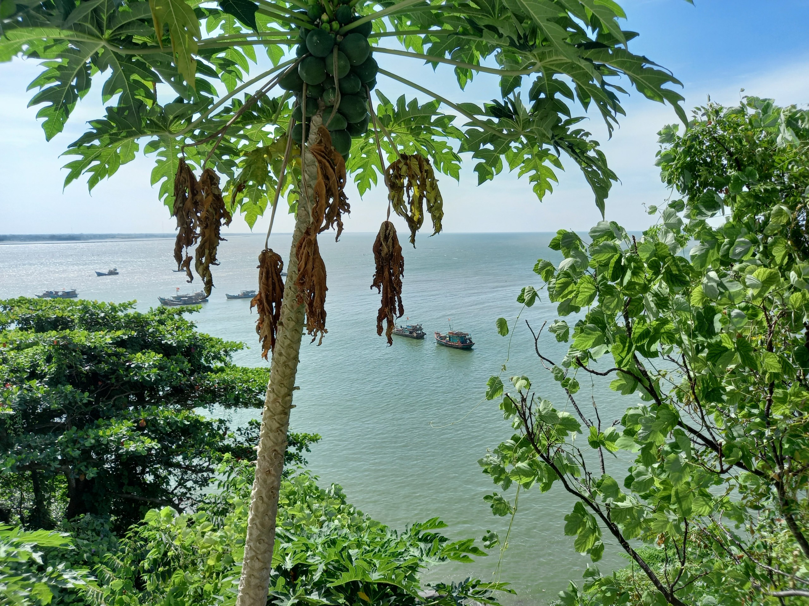

Đặt tiêu đề này xong tự nhiên mình thấy buồn cười. Cấu trúc “Mình + (Động từ) + Thành tựu + như thế nào?” đã trở nên quá quen thuộc trên mạng xã hội. Khi “thành tựu” là điều nhiều người mơ ước hay đơn giản là thứ người ta tò mò muốn biết về, tiêu đề theo cấu trúc kể trên quả là một cái hố đen hút người. Mình không có ý chỉ trích vì nó cũng chỉ tuân theo quy luật cung cầu - người sáng tạo nội dung và người tìm kiếm “làm thế nào để…?”. Lý do mình buồn cười ở trên là vì mình chưa bao giờ đặt tiêu đề như vậy và thành tựu “đỡ đau đầu” của mình có lẽ cũng không phải là thứ nhiều người tìm kiếm. Đơn giản là một bài viết chia sẻ ý kiến cá nhân!

*Ảnh: Chỉ là một ngôi nhà nhỏ ở trên đồi*

Bài hôm nay mình tập trung nói đến thông tin từ mạng xã hội. Nếu như trước đây thông tin được truyền đi bị giới hạn bởi địa lý, phương tiện vận chuyển, điều kiện kinh tế hay những mối quan hệ thì bây giờ nó chả còn cái giới hạn nào cả. Nhờ vào Internet, các công cụ tìm kiếm, phương tiện truyền thông đại chúng như TV, báo đài,... mà ai cũng có thể tiếp cận được thông tin mà họ cần, giúp họ giải quyết vấn đề đang mắc phải (công thức nấu bún bò, trang phục phù hợp khi ra mắt nhà bạn trai, cách xử lý khi cơm bị nhão,...) hay đáp ứng nhu cầu giải trí, cập nhật thông tin (xem phim, xem thời sự,...). Thế nhưng, chúng ta dường như không thể ngồi hàng giờ trước máy tính tìm kiếm câu trả lời cho mọi vấn đề của mình và TV không phải lúc nào cũng chiếu chương trình yêu thích, đó là lý do mình tin rằng trước đây chúng ta đã là người chủ động tìm kiếm thông tin mình cần. Và rồi khi mạng xã hội xuất hiện với những thuật toán cá nhân hóa siêu đỉnh mà mình cũng không biết chúng vuông hay tròn, chúng ta có thể xem chương trình yêu thích, đọc những gì chúng ta muốn và kết nối với cả thế giới ở bất kỳ đâu, bất kỳ lúc nào. Thế giới đã chuyển đổi từ việc con người tìm kiếm thông tin sang việc thông tin tìm kiếm con người. Từ đó giúp con người tiếp cận thêm một loại thông tin nữa mang tên “thông tin mà họ không cần”. Chỉ trong vòng 30 phút lướt Facebook, Youtube hay TikTok, chúng ta dường như nắm được hết mọi sự kiện đang nổi, nhân vật có phát ngôn gây sốc, thành tựu của người khác, tin đồn hay những chiếc quảng cáo xuất hiện sau khi “nghe lỏm” cuộc nói chuyện của chúng ta với bạn bè. Những thông tin trên có thực sự cần thiết hay không? Một câu trả lời khái quát nhất, theo mình, là “Biết cũng được, không biết cũng không sao”, nghĩa là nó không cần thiết. Việc liên tục tiếp cận với những thông tin trên chỉ giúp chúng ta thỏa mãn trí tò mò, giải quyết FOMO (nỗi sợ bỏ lỡ hay nỗi sợ bị lạc hậu và khó hòa nhập nếu mình không biết thông tin mà mọi người đều biết) và hiện thực hóa niềm tin rằng chúng ta sẽ tốt lên sau khi đọc những thông tin như vậy. Tất cả những điều trên chỉ là điều chúng ta muốn, không phải điều chúng ta cần. Có lẽ, tiếp cận một lượng thông tin nhiều đến ngập mặt như vậy mỗi ngày, chúng ta cũng không còn thời gian hỏi bản thân “Mình thực sự cần gì?” nữa.

*Ảnh: Để không bị nhấn chìm, ta chỉ có thể vươn lên*

Chúng ta đã quá quen với việc quá tải thông tin và đang bình thường hóa việc này. Quá tải thông tin xảy ra khi chúng ta cố gắng xử lý nhiều hơn lượng thông tin mà não bộ có thể xử lý hiệu quả. Khái niệm này không xuất hiện sau khi có mạng xã hội mà kể từ khi con người phát minh ra máy in cách đây vài trăm năm, công nghệ đã được dự đoán rằng sẽ giúp thông tin lan truyền rộng rãi và tạo ra một làn sóng thông tin khiến chúng ta khó mà kiểm soát được (nghe y chang thời nay chưa). Tác giả Positioning cũng đã đề cập đến điều này khi nói về báo chí, TV, nội dung quảng cáo và thông tin in trên sản phẩm. Hiện tại, những phương tiện truyền thông cũ cùng với mạng xã hội càng khiến những bộ não quá tải quá tải hơn, nhưng lại theo cách vô cùng giải trí. Mình nghĩ, chính vì sự giải trí mà thông tin trên mạng xã hội mang lại, chúng ta vui lòng tiếp nhận chúng mà không nhận thức được rõ ràng rằng mình bị quá tải thông tin. Trong trường hợp nhận thức được, thói quen lướt mạng xã hội cũng là thứ khó có thể thay thế. Mỗi người trong chúng ta đều có những ưu tiên khác nhau, thế nên 1 Huyền Minh ưu tiên trí tò mò và “cảm giác hiểu biết” và 1 Huyền Minh ưu tiên sức khỏe tinh thần (mình từng có những trải nghiệm cảm xúc khá tệ với thông tin không cần thiết trên mạng xã hội) sẽ có những cách sử dụng mạng xã hội khác nhau. Mình không đề xuất cũng không chỉ trích, mọi thứ đều là sự ưu tiên và sự lựa chọn. 

*Ảnh: Nhờ có cây, nắng cũng đỡ gay gắt*

Dù việc quá tải thông tin gây ra những ảnh hưởng xấu đến trí nhớ hay khả năng tập trung của não bộ, chúng ta đang thích ứng tốt với thế giới thông tin. Phần này để trống cho những tiêu đề “Cách chọn lọc thông tin”, “Cách tập trung làm việc”,...  Và mình cũng có cách của mình. 

Mình nghĩ rằng, trong thế giới thông tin, mình dễ dàng bị điều hướng bởi thông tin. Cũng giống như trong thế giới phép thuật (đồng tiền), phép thuật (đồng tiền) mới chính là thứ điều khiển chúng ta vậy đó. Mình không muốn như vậy. Mình sợ mất đi bản thân, mất đi suy nghĩ, quan điểm, hành vi hay thói quen chỉ vì “nghe người ta nói”. Nếu như mình không thể tách mình khỏi tập thể, nếu như mình không thể không bị ảnh hưởng bởi môi trường, mình sẽ biến những ảnh hưởng đó áp lên mình theo cách của mình. Mong rằng mọi người sẽ đọc tiếp phần 2 để xem mình ứng phó với cơn lũ thông tin như thế nào!
